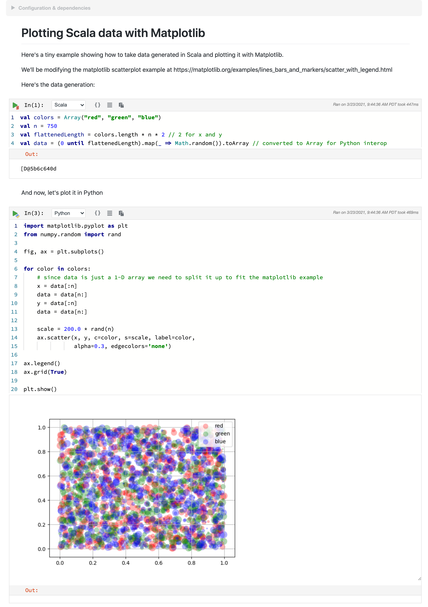

## Mixing programming languages

One of Polynote's most interesting features is its support for polyglot notebooks, where cells within the same notebook 
can be written in different languages. 

Continuing our example notebook from [before](basic-usage.md), here's a trivial example (note that the bottom cell has
Python selected in the language drop-down). 


The `foo` and `bar` Scala variables can be accessed directly in Python, because they represent primitive 
types (`:::scala Int`s in this case).

A more complex example of a more typical usage can be found in the `examples/` folder in 
[`Plotting Scala data with Matplotlib.ipynb`](https://github.com/polynote/polynote/blob/master/docs/examples/Plotting%20Scala%20data%20with%20Matplotlib.ipynb)
which is reproduced below. We'll go over this example in detail.



!!!tip "Real-world usage at Netflix"
    This example notebook illustrates a contrived version of a common use-case at Netflix. [Our recommendation and 
    personalization infrastructure is heavily JVM-based](https://www.slideshare.net/FaisalZakariaSiddiqi/ml-infra-for-netflix-recommendations-ai-nextcon-talk),
    and Algorithm Engineers and Scientists want to interface with our platform in order to, for example:

    - [transform data in a type-safe way using Scala](https://portal.klewel.com/watch/webcast/scala-days-2019/talk/12/)
    - [access Model Lifecycle data](https://www.usenix.org/conference/opml20/presentation/cepoi)
    - [generate features based on online data snapshots](https://netflixtechblog.com/distributed-time-travel-for-feature-generation-389cccdd3907)

    Once they get the data, they'd like to analyze and visualize it using the Python tools they are familiar with, such
    as [pandas](https://pandas.pydata.org/) and [matplotlib](https://matplotlib.org/).

Let's go over this notebook, which consists of two cells. The first, a Scala cell, prepares some data, while the second,
a Python cell, plots it.

!!!example "Scala cell"
    ```scala
    val colors = Array("red", "green", "blue")
    val n = 750
    val flattenedLength = colors.length * n * 2 // 2 for x and y
    val data = (0 until flattenedLength).map(_ => Math.random()).toArray // converted to Array for Python interop
    ```

This cell generates an `:::scala Array[Double]` that is a flattened representation of data in three dimensions - `color`, 
`x`, and `y`. 

This data is then fed into the Python cell to be plotted: 

!!!example "Python cell"
    ```python
    import matplotlib.pyplot as plt
    from numpy.random import rand

    fig, ax = plt.subplots()

    for color in colors:
        # since data is just a 1-D array we need to split it up to fit the matplotlib example
        x = data[:n]
        data = data[n:]
        y = data[:n]
        data = data[n:]

        scale = 200.0 * rand(n)
        ax.scatter(x, y, c=color, s=scale, label=color,
                   alpha=0.3, edgecolors='none')

    ax.legend()
    ax.grid(True)

    plt.show()
    ```

This cell steps through the `data` array and, for each `color`, unflattens the `x` and `y` data for plotting (note that
both `data` and `color` are Scala variables accessed directly from Python).

This is pretty straightforward, but you might have noticed that the interchange values between the two languages are
`:::scala Array`s, rather than the more idiomatic (for Scala) `:::scala Seq`s. You might also notice that it was pretty 
unnatural to flatten `data` like we did. 

The reason for this is that it's easier to interchange between Scala and Python using primitives and basic structures 
like Arrays. You might not realize it, but when you work with Scala there's all sorts of stuff going on behind the scenes, 
such as implicits, or <TODO, how to call `$colon$colon()`?>), but when we move into Python we see the object in all its gory details without any help: 


However, with a little Scala knowledge we can rewrite this code to be more idiomatic, at the expense of having to do 
(a bit) more work in Python to massage the data. 

First, we'll use some more idiomatic code to generate our point data: 

```scala
case class Point(x: Double, y: Double, color: String)
val colors = Seq("red", "green", "blue")
val n = 750
val idiomaticData = for {
    color <- colors
    n     <- (0 to n)
} yield Point(Math.random(), Math.random(), color)
```

Wow, a `:::scala case class` AND a `:::scala for` expression? This is surely extremely idiomatic Scala code. 
Not an `:::scala Array` in sight!

Let's inspect `idiomaticData` for a moment. 


!!!info "Inspecting and Visualizing Data"
    This image showcases using the [Quick Inspector](symbol-table.md#quick-inspector) and [Viz cells](visualization-and-viz-cells.md) 
    to easily inspect values within a notebook.

Now that we've taken a look at `idiomaticData` and seen that it's a `:::scala Seq[Point]`, we can delete the Viz cell and 
start working with it using Python. 

Since we're no longer working with primitives, we need to do a little data preparation. We'll build a `:::python list`, 
iterate over `idiomaticData`, and extract values from `Point`. 

We want to end up with a simple 2D-Array we can use with `matplotlib`. 

```python
data = []
for idx in range(0, idiomaticData.length()):
    point = idiomaticData.apply(idx)
    data.append([point.x(), point.y(), point.color()])

data
```

There are a couple things to note here. 

First, we need to generate an index in order to iterate through the `Seq`, and then use its 
[`:::scala apply(idx: Int): A`](https://www.scala-lang.org/api/2.12.0/scala/collection/Seq.html#apply(idx:Int):A)
method to select elements from it. 

Second, we'll access the `:::scala case class` members using the member accessor methods as usual, but note that with 
Python we need to specify `()`, as in `:::python point.x()`, since of course in Python parentheses are always required, 
even for nullary functions (ones that have no arguments). 

Using Pandas to add columns:
```python
import numpy as np
import pandas as pd

df = pd.DataFrame(data=data, columns=['x', 'y', 'color'])

# add the random scala column in Python
df['scale'] = np.random.uniform(1, 200, df.shape[0])

print(df.head())
```

Plotting the data:
```python
import matplotlib.pyplot as plt

fig, ax = plt.subplots()

groups = df.groupby("color")
for name, group in groups:
    ax.scatter(group.x, group.y, c=group.color, s=group.scale, label=name,
               alpha=0.3, edgecolors='none')

ax.legend(loc="upper right")
ax.grid(True)

plt.show()
```

We find that this lets us do some pretty neat things, but it does have some limitations and caveats, and plenty of edge-cases
left to be worked out. 

### Execution state in Polynote

We hinted [previously](02-basic-usage.md#The-symbol-table-and-input-scope) that the way Polynote handles cell execution
is a little special.

As a reminder, the kernel keeps track of all the symbols defined by a cell execution. These symbols are part 
of the cell's state, which is made available to downstream cells (those below the cell in question) when they in turn 
are executed. 

Polynote stores these symbols, alongside their types and other information, in a Scala-based format. Symbols defined by
and provided to other languages are wrapped (and unwrapped) appropriately. 

### Sharing between Python and Scala

For now, Python is the major non-JVM-based language you'll be using with Polynote. Polynote uses 
[jep](https://github.com/ninia/jep) to do most of the heavy-lifting when it comes to Python interop. If you're going to
be moving back and forth between Python and Scala a lot, we highly recommend reading about 
[how Jep works](https://github.com/ninia/jep/wiki/How-Jep-Works).

Our goals right now are to support a few, key use-cases with a focus on sharing from Scala to Python, 
such as plotting data generated in Scala with `matplotlib`, or using Scala-generated data with `tensorflow` and 
`scikit-learn`. We've found that the interop between Python and Scala can be very powerful even if it is limited to these 
simple cases. 

TODO: Break this out into "Advanced" section?

Here are a few important points to keep in mind when sharing between Python and Scala:

* Jep handles the conversion from Scala -> Python. 
  * It converts primitives and strings into brand-new Python primitives and strings. 
  * An object of any other type is wrapped as a `PyJObject`, which is an interface allowing Python to directly access 
    that objects attributes. Note that in this case, nothing is copied - `PyJObject` holds a reference to the underlying 
    JVM object. 
  * Note that Jep is based on Java, not Scala. This means that when it wraps a Scala object as a `PyJObject`, you won't 
    get Scala sugar - things like multiple parameter lists, implicits, etc. - when you work with it in Python. 
    This can limit your ability to use a lot of super-scala-stuff with Python.
* Jep handles conversion from Python -> Scala and Polynote adds a little bit of sugar on top. 
  * Similar to the other way round, Jep automatically converts primitives and strings into brand-new JVM primitives and strings.
  * Additionally, Jep supports some other conversions such as Python `dict` to `java.util.HashMap`
  * Polynote will retrieve an object of any other type as a `PyObject`. Similar to `PyJObject`, a `PyObject` wraps a pointer
    to a Python object. Polynote has some support for handling certain types of Python objects, typically for visualization 
    purposes. 

Note that these implementation details may change and while we'll work hard to update this information we can't guarantee
that it won't get out-of-date. Of course, feel free to [drop us a line](https://gitter.im/polynote/polynote) if you 
think that's the case!

### Cookbook

We have a bunch of example notebooks over in the [examples folder](https://github.com/polynote/polynote/tree/master/docs/examples), 
showcasing various useful tricks and things to keep in mind while working with Polynote. 

